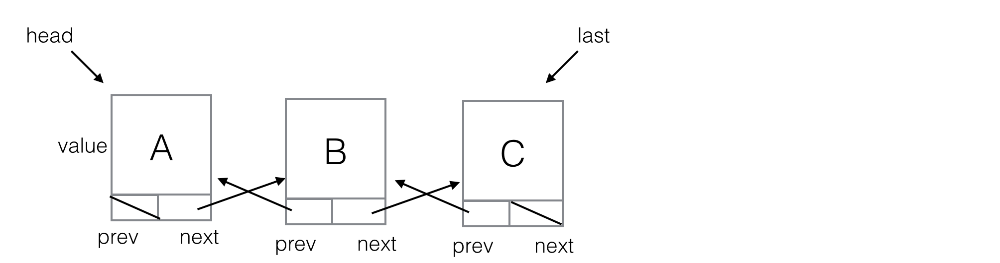

# Doubly Linked Lists

A mini-course in doubly linked lists in JS for novice programmers.

## Prerequisites

Mastery of [linked lists](https://github.com/mikegagnon/linked-lists/blob/master/README.md)

## Contents

- [Lecture 1. DNode](#lec1)
- [Lecture 2. `insertAfter(...)`](#lec2)
- [Lecture 3. `insertBefore(...)`](#lec3)
- [Lecture 4. `append(...)`](#lec4)
- [Lecture 5. `prepend(...)`](#lec5)
- [Lecture 6. `removeFirst(...)`](#lec6)


## <a name="lec1">Lecture 1. DNode</a>

Doubly linked lists are like linked lists (aka singly linked lists), except every node has a `prev` reference and a `next` reference.



The clients must keep track of `head` and `last` themselves.

### `dlists.js`

Here's the class definition for DNode:

```js
class DNode {
    constructor(value) {
        this.value = value;
        this.prev = undefined;
        this.next = undefined;
    }
}
```

### `index.html`

```html
<!DOCTYPE html>
<html>
  <head>
    <title>Doubly Linked Lists</title>
    <script src="dlists.js"></script>
  </head>
</html>
```

## <a name="lec2">Lecture 2. `insertAfter(...)`</a>

```js
class DNode {
    
    ...

    // Creates a new node to hold value, then inserts the new node after
    // this node.
    //
    // Returns a reference to the new node
    insertAfter(value) {
        
        var newNode = new DNode(value);

        newNode.next = this.next;
        newNode.prev = this;

        if (newNode.next != undefined) {
            newNode.next.prev = newNode;
        }

        this.next = newNode;

        return newNode;
    }
}

// Create list: A, D, B, E, C
var a = new DNode("A");
var b = a.insertAfter("B");
var c = b.insertAfter("C");
var d = a.insertAfter("D");
var e = b.insertAfter("E");

assert(a.value == "A");
assert(a.prev == undefined);
assert(a.next == d);

assert(d.value == "D");
assert(d.prev == a);
assert(d.next == b);

assert(b.value == "B");
assert(b.prev == d);
assert(b.next == e);

assert(e.value == "E");
assert(e.prev == b);
assert(e.next == c);

assert(c.value == "C");
assert(c.prev == e);
assert(c.next == undefined);
```

The algorithmic performance of `insertAfter(...)` is *O(1)*.

## <a name="lec3">Lecture 3. `insertBefore(...)`</a>

```js
class DNode {
    
    ...
    
    // Creates a new node to hold value, then inserts the new node before
    // this node.
    //
    // Returns a reference to the new node
    insertBefore(value) {

        var newNode = new DNode(value);

        newNode.next = this;
        newNode.prev = this.prev;

        if (newNode.prev != undefined) {
            newNode.prev.next = newNode;
        }

        this.prev = newNode;

        return newNode;
    }
}

// Create list: C, D, B, E, A
var a = new DNode("A");
var b = a.insertBefore("B");
var c = b.insertBefore("C");
var d = b.insertBefore("D");
var e = a.insertBefore("E");

assert(c.value == "C");
assert(c.prev == undefined);
assert(c.next == d);

assert(d.value == "D");
assert(d.prev == c);
assert(d.next == b);

assert(b.value == "B");
assert(b.prev == d);
assert(b.next == e);

assert(e.value == "E");
assert(e.prev == b);
assert(e.next == a);

assert(a.value == "A");
assert(a.prev == e);
assert(a.next == undefined);
```

The algorithmic performance of `insertBefore(...)` is *O(1)*.

## <a name="lec4">Lecture 4. `append(...)`</a>

```js
class DNode {
    
    ...
    
    // Creates a new node to hold value, then appends the new node to 
    // the end of the list.
    //
    // this node __must__ be the last node in the list
    // 
    // Returns a reference to the new node
    append(value) {
        if (this.next == undefined) {
            return this.insertAfter(value);
        } else {
            console.error("this node __must__ be the last node in the list");
        }
    }
}

// Test for append
// Create a list A, B, C
var a = new DNode("A");
var b = a.append("B");
var c = b.append("C");

assert(a.value == "A");
assert(a.prev == undefined);
assert(a.next == b);

assert(b.value == "B");
assert(b.prev == a);
assert(b.next == c);

assert(c.value == "C");
assert(c.prev == b);
assert(c.next == undefined);
```

The algorithmic performance of `append(...)` is *O(1)*.


## <a name="lec5">Lecture 5. `prepend(...)`</a>

```js
class DNode {
    
    ...
    
    // Creates a new node to hold value, then prepend the new node to 
    // the head of the list.
    //
    // this node __must__ be the first node in the list
    // 
    // Returns a reference to the new node
    prepend(value) {
        if (this.prev == undefined) {
            return this.insertBefore(value);
        } else {
            console.error("this node __must__ be the last node in the list");
        }
    }
}

// Test for prepend
// Create a list C, B, A
var a = new DNode("A");
var b = a.prepend("B");
var c = b.prepend("C");

assert(c.value == "C");
assert(c.prev == undefined);
assert(c.next == b);

assert(b.value == "B");
assert(b.prev == c);
assert(b.next == a);

assert(a.value == "A");
assert(a.prev == b);
assert(a.next == undefined);
```

The algorithmic performance of `prepend(...)` is *O(1)*.
